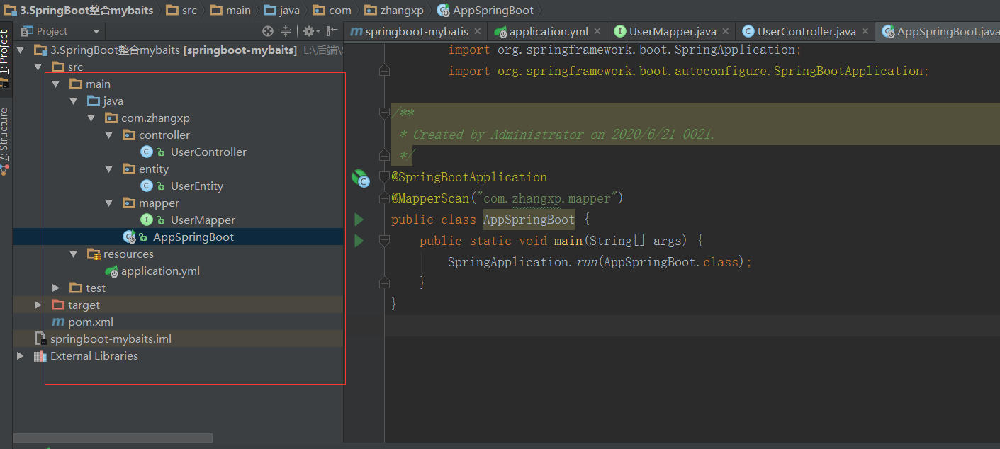

# Spring Boot整合其他框架

## 一. Web开发

### 1.1 静态资源访问

在我们开发Web应用的时候，需要引用大量的js,css,图片等静态资源。

默认配置：

Spring Boot默认提供静态资源目录位置需要置于classpath下,目录名需符合如下规则：

- /static
- /public
- /resources
- /META-INF/resources

举例：我们可以在src/main/resources/目录下创建static,在该位置放置一个图片文件。启动程序后，尝试访问http://localhost:8080/D.jpg.如能显示图片，配置成功。

**注意**: 上述目录都是用根路径/ + 资源名称即可访问，不需要在路径中加/static等。但是如果再/static下建立新的文件夹，需要用/newfiles/资源名访问。

### 1.2 渲染Web页面

**渲染web页面**

在之前的示例中，我们都是通过@RestController来处理请求，所以返回的内容为json对象。那么如果需要渲染html页面的时候，要如何实现呢？

**模板引擎**

在动态HTML实现上Spring Boot依然可以完美胜任，并且提供了多种模板引擎的默认配置支持，所以在推荐的模板引擎下，我们可以很快的上手开发动态网站。

Spring Boot提供了默认配置的模板引擎主要有以下几种：

- Thymeleaf
- FreeMarker
- Velocity
- Groovy
- Mustache

Spring Boot建议使用这些模板引擎，避免使用JSP，若一定要使用JSP将无法实现Spring Boot的多种特性，具体可见后文：支持JSP配置。

当然你使用上述模板引擎中的任何一个，他们默认的模板配置路径为:**src/main/resources/templates**。当然也可以修改这个路径，具体如何修改，可在后续各模板引擎的配置属性中查询并修改。

### 1.3 使用Freemarker模板引擎渲染web视图

#### 1.3.1 pom文件引入：

```java
<!--2. 引入Freemarker依赖包 -->
<dependency>
    <groupId>org.springframework.boot</groupId>
    <artifactId>spring-boot-starter-freemarker</artifactId>
</dependency>
```

#### 1.3.2 前台代码

在src/main/resources/创建一个templates文件夹，后缀为*.ftl

```html
<!DOCTYPE html>
  <html>
    <head lang="zh">
        <meta charset="UTF-8"/>
        <title>首页</title>
    </head>

    <body>
        ${name}
        <#if sex == "1">
            男
        <#elseif sex == "2">
        女
        <#else>
        其他
        </#if>
        <#list objects as user>
            ${user}
        </#list>
    </body>
</html>
```

#### 1.3.3 后台代码

```java
package com.zhangxp.api.controller;

/**
 * Created by Administrator on 2020/6/21 0021.
 */

import org.springframework.stereotype.Controller;
import org.springframework.web.bind.annotation.RequestMapping;
import org.springframework.web.bind.annotation.ResponseBody;
import org.springframework.web.bind.annotation.RestController;

import java.util.ArrayList;
import java.util.Map;
@Controller
public class IndexController {
    @ResponseBody
    @RequestMapping("/index")
    public String index() {
        return "我是index控制类!";
    }

    @RequestMapping("/freemarkerIndex")
    public String freemarkerIndex(Map<Object, Object> resultMap) {
        resultMap.put("name", "张晓平");
        resultMap.put("sex", "1");
        ArrayList<Object> objects = new ArrayList<>();
        objects.add("zhangxp");
        objects.add("spring boot");
        resultMap.put("objects", objects);
        return "freemarkerIndex";
    }
}

```

#### 1.3.4 FreeMarker配置

在resources/下增加配置文件application.yml

```yaml
spring:
  http:
    encoding:
      force: true
      charset: UTF-8
  freemarker:
    allow-request-override: false
    cache: false
    check-template-location: true
    charset: UTF-8
    content-type: text/html; charset-utf-8
    expose-request-attributes: false
    expose-session-attributes: false
    expose-spring-macro-helpers: false
    suffix: .ftl
    template-loader-path: classpath:/templates
```

## 二. 数据访问

springboot2多数据源读取名称时存在bug,jdbc-url

#### 2.1 SpringBoot使用jdbc

##### 2.1.1 pom.xml引入

```java

<dependencies>
    <!--1. spring boot web 组件整合了springmvc和spring-->
        <dependency>
            <groupId>org.springframework.boot</groupId>
            <artifactId>spring-boot-starter-web</artifactId>
        </dependency>

        <dependency>
            <groupId>org.springframework.boot</groupId>
            <artifactId>spring-boot-starter-test</artifactId>
        </dependency>

        <!-- spring boot 整合jdbc-->
        <dependency>
            <groupId>org.springframework.boot</groupId>
            <artifactId>spring-boot-starter-jdbc</artifactId>
        </dependency>

        <dependency>
            <groupId>mysql</groupId>
            <artifactId>mysql-connector-java</artifactId>
            <version>5.1.46</version>
        </dependency>

</dependencies>
```

##### 2.1.2配置文件application.yml

```yaml
spring:
  datasource:
    url: jdbc:mysql://192.168.200.129:3308/dbblog
    username: root
    password: 7324368Best!@
    driver-class-name: com.mysql.jdbc.Driver
```

##### 2.1.3 编写服务

```java
package com.zhangxp.service;

import org.springframework.beans.factory.annotation.Autowired;
import org.springframework.jdbc.core.JdbcTemplate;
import org.springframework.stereotype.Service;

/**
 * Created by Administrator on 2020/6/21 0021.
 */
@Service
public class UserService {
    @Autowired
    private JdbcTemplate jdbcTemplate;

    public boolean addUser(String name, Integer age) {
        int update = jdbcTemplate.update("insert into users values(null, ?, ?);", name, age);
        return update > 0 ? true : false;
    }
}

```

```
package com.zhangxp.controller;

import com.zhangxp.service.UserService;
import org.springframework.beans.factory.annotation.Autowired;
import org.springframework.web.bind.annotation.RequestMapping;
import org.springframework.web.bind.annotation.RestController;

/**
 * Created by Administrator on 2020/6/21 0021.
 */
@RestController
public class MyBaseController {
    @Autowired
    public UserService userService;

    @RequestMapping("/addUser")
    public String addUser(String name, Integer age) {
        return userService.addUser(name, age) ? "success": "falied";
    }

}
```

```java
package com.zhangxp;


import org.springframework.boot.SpringApplication;
import org.springframework.boot.autoconfigure.SpringBootApplication;

@SpringBootApplication
public class AppSpringBoot {
    public static void main(String[] args) {
        SpringApplication.run(AppSpringBoot.class);
    }
}
```

访问url:

http://localhost:8080/addUser

#### 2.2 SpringBoot使用mybatis

##### 2.2.1 pom.xml引入

```html
<parent>
    <groupId>org.springframework.boot</groupId>
    <artifactId>spring-boot-starter-parent</artifactId>
    <version>2.2.6.RELEASE</version>
</parent>

<dependencies>
    <!--1. spring boot web 组件整合了springmvc和spring-->
    <dependency>
        <groupId>org.springframework.boot</groupId>
        <artifactId>spring-boot-starter-web</artifactId>
    </dependency>

    <dependency>
        <groupId>org.springframework.boot</groupId>
        <artifactId>spring-boot-starter-test</artifactId>
    </dependency>

    <!-- spring boot 整合jdbc-->
    <dependency>
        <groupId>org.mybatis.spring.boot</groupId>
        <artifactId>mybatis-spring-boot-starter</artifactId>
        <version>2.1.2</version>
    </dependency>

    <dependency>
        <groupId>mysql</groupId>
        <artifactId>mysql-connector-java</artifactId>
        <version>5.1.46</version>
    </dependency>
</dependencies>
```

##### 2.2.2  建立配置文件 /resources/application.yml

```ya
spring:
  datasource:
    url: jdbc:mysql://192.168.200.129:3308/dbblog?useSSL=false
    username: root
    password: 7324368Best!@
    driver-class-name: com.mysql.jdbc.Driver
```

##### 2.2.3 编写mapper层

```java
package com.zhangxp.mapper;

import org.apache.ibatis.annotations.Insert;
import org.apache.ibatis.annotations.Param;
import org.apache.ibatis.annotations.Select;
import com.zhangxp.entity.UserEntity;
/**
 * Created by Administrator on 2020/6/21 0021.
 */
// mybatis有两种形式：xml和注解
public interface UserMapper {
    @Select("select * from users where name = #{name}")
    UserEntity findByName(@Param("name") String name);
    @Insert("insert into users(name, age) values(#{name}, #{age})")
    int insert(@Param("name") String name, @Param("age") Integer age);
}

```

##### 2.2.4 编写entity层

```java
package com.zhangxp.entity;

/**
 * Created by Administrator on 2020/6/21 0021.
 */
public class UserEntity {
    private String name;
    private Integer age;

    public String getName() {
        return name;
    }

    public Integer getAge() {
        return age;
    }

    public void setAge(Integer age) {
        this.age = age;
    }

    public void setName(String name) {
        this.name = name;
    }
}

```

##### 2.2.5 编写controller层

```java
package com.zhangxp.controller;

import com.zhangxp.mapper.UserMapper;
import org.springframework.beans.factory.annotation.Autowired;
import org.springframework.web.bind.annotation.RequestMapping;
import org.springframework.web.bind.annotation.RestController;

/**
 * Created by Administrator on 2020/6/21 0021.
 */
@RestController
public class UserController {
    @Autowired
    private UserMapper userMapper;

    @RequestMapping("/addUser")
    public String addUser(String name, Integer age) {
        return userMapper.insert(name, age) > 0 ? "succes" : "failed";
    }
}

```

##### 2.2.6 编写SpringBoot启动类

注意：添加@MapperScan注解，指定扫描mapper的范围。

```java
package com.zhangxp;

import org.mybatis.spring.annotation.MapperScan;
import org.springframework.boot.SpringApplication;
import org.springframework.boot.autoconfigure.SpringBootApplication;

/**
 * Created by Administrator on 2020/6/21 0021.
 */
@SpringBootApplication
@MapperScan("com.zhangxp.mapper")
public class AppSpringBoot {
    public static void main(String[] args) {
        SpringApplication.run(AppSpringBoot.class);
    }
}

```

访问http://localhost:8080/addUser?name=zhangxa&age=13

成功！

##### 2.2.7 最终的代码结构:



#### 2.3 SpringBoot整合多数据源

#### 2.4 SpringBoot整合rabbitmq

