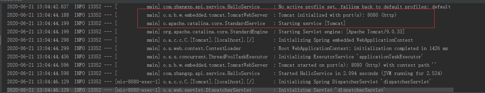
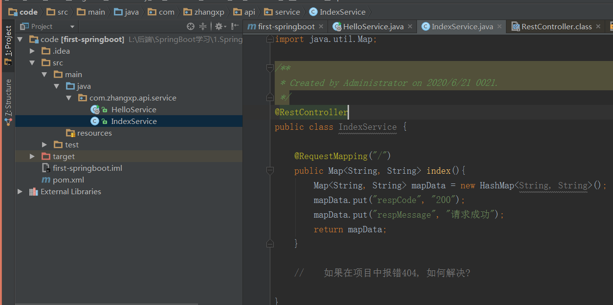

# SpringBoot简介基本使用

## 1.为什么使用SpringBoot?

因为SpringBoot是一个快速的开发框架，能够帮助程序员快速的整合第三方框架，内嵌入第三方常用容器(tomcat,jetty),完全简化xml配置，采用注解形式；

**SpringBoot**特性：

- 帮助开发者快速整合第三方框架(原理Maven依赖封装)
- 完全不需要外部服务器运行，内嵌入服务器(tomcat,jetty,undertow)原理:java语言创建tomcat
- 完全采用注解形式替代了xml,原理因为因为Spring体系本身支持注解启动，只是做了包装

## 2. SpringBoot和SpringMVC的关系

spring-boot-starter-web默认是整合了SpringMVC,Spring

SpringBootWeb组件采用了SpringMVC框架

SpringBoot与微服务概念

微服务中Rpc远程通讯技术，采用springmvc编写接口,Http+json协议

## 3. SpringBoot与SpringCloud区别

SpringCloud是当前一套比较流行的微服务解决方案框架；是一套全家桶的微服务框架。

SpringCloud本身并不是远程rpc调用框架，Feign是。

常用组件：

Eureka 服务注册

Feign 客户端实现rpc远程调用

Zuul 网关

Ribbin 本地负载均衡器

SpringCloudConfig 

Hystrix 服务保护


Spring Cloud依赖SpringBoot web组件springmvc编写微服务接口，同时Spring Cloud是当前比较流行的微服务解决方案框架。


## 4.用IDEA搭建第一个SpringBoot项目

修改pom.xml

```java
<parent>
    <groupId>org.springframework.boot</groupId>
    <artifactId>spring-boot-starter-parent</artifactId>
    <version>2.2.6.RELEASE</version>
    </parent>

<dependencies>
    <!--1. spring boot web 组件整合了springmvc和spring-->
    <dependency>
    <groupId>org.springframework.boot</groupId>
    <artifactId>spring-boot-starter-web</artifactId>
    </dependency>
</dependencies>
```

编写代码:

```java
package com.zhangxp.api.service;

import org.springframework.boot.SpringApplication;
import org.springframework.boot.autoconfigure.EnableAutoConfiguration;
import org.springframework.web.bind.annotation.RequestMapping;
import org.springframework.web.bind.annotation.RestController;

/**
 * Created by Administrator on 2020/6/21 0021.
 */
@RestController
// @EnableAutoConfiguration注解实际上启动SpringMvc
@EnableAutoConfiguration
// @RestController注解:表示当前所定义的方法统一返回json,原理就是通过@Controller,@ResponseBody组合
public class HelloService {
    @RequestMapping("/hello")
    public String Hello(){
        return "张晓平第一次学习Srping Boot课程";
    }

    public static void main(String[] args) {
        SpringApplication.run(HelloService.class, args);
    }
}
```

启动服务:

内嵌了Tomcat服务器



## 5. 使用@ComponentScan("com.zhangxp.api.service")注解指定扫包范围

我们再编写一个服务:

```java

```



再次启动项目,访问我们的localhost:8080/发现报错404，原因是当前扫包范围默认只是HelloService,我们需要在HelloService代码里加上注解@ComponentScan("com.zhangxp.api.service").

```java
@RestController
// @EnableAutoConfiguration注解实际上启动SpringMvc
// 这个注解扫包的范围为当前这个类
@EnableAutoConfiguration
// @RestController注解:表示当前所定义的方法统一返回json,原理就是通过@Controller,@ResponseBody组合
@ComponentScan("com.zhangxp.api.service")
public class HelloService {
    @RequestMapping("/hello")
    public String Hello(){
        return "张晓平第一次学习Srping Boot课程";
    }

    public static void main(String[] args) {
        SpringApplication.run(HelloService.class, args);
    }
}
```

再次启动，OK了。

## 6. 使用@SpringBootApplication注解

```java
package com.zhangxp.api.service;

import org.springframework.boot.SpringApplication;
import org.springframework.boot.autoconfigure.SpringBootApplication;


/**
 * Created by Administrator on 2020/6/21 0021.
 */
@SpringBootApplication
public class AppSpringBoot {
    public static void main(String[] args) {
        SpringApplication.run(AppSpringBoot.class, args);
    }
//    @SpringBootApplication注解等同于@Configuration+@EnableAutoConfiguration+@ComponentScan
//    SpringBoot的启动类的扫包范围就是启动类所在包com.zhangxp.api.service
}

```

因为SpringBoot启动类的扫包范围是其所在包的范围，所以如果我们想要扫到我们编写的类，需要放到与SpringBoot启动类同级或者子级:


