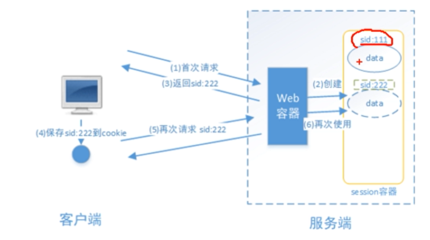
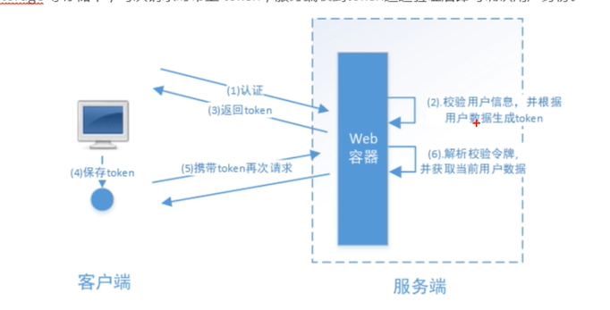
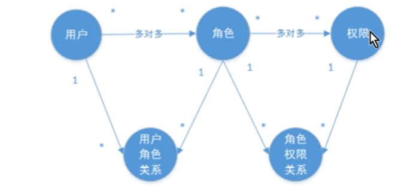
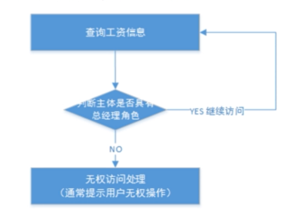

# Spring Security OAuth2.0认证授权

## 1.基本概念

### 1.1.什么是认证?

认证是为了保护系统的隐私数据与资源，用户的身份合法可访问该系统的资源。

认证： 用户认证就是判断一个用户的身份是否合法的过程，用户去访问系统资源时系统要求验证用户的身份信息，身份合法方可继续访问，不合法则拒绝访问。常见的用户身份认证方式有：用户名密码登录，二维码登录，手机短信登录，指纹认证等方式。

### 1.2 什么是会话？

用户认证通过后，为了避免用户的每次操作都进行认证可将用户的信息保存在会话中。会话就是系统为了保持当前用户的登录状态所提供的机制，常见的有基于session方式，基于token方式等。

基于session的认证方式如下图:

它的交互流程是，用户认证成功后，在服务端生成用户相关的数据保存在session(当前会话)中，发给客户端的session_id存放到cookie中，这样用户客户端请求时带上session_id就可以验证服务器端是否存在session数据，以此完成用户的合法校验，当用户退出系统或session过期销毁时，客户端的session_id也就无效了。

基于token方式如下图：

它的交互流程是，用户认证成功后，服务端生成一个token发给客户端，客户端可以放到cookie或localStorage等存储中，每次请求时带上token,服务端收到token通过验证后即可确认用户身份。

基于session的认证方式由Servlet规范定制，服务端要存储session信息需要占用内存资源，客户端需要支持cookie；基于token的方式则一般不需要服务端存储token,并且不限制客户端的存储方式。如今移动互联网时代更多类型的客户端需要接入系统，系统多是采用前后端分离的架构进行实现，所以基于token的方式更适合。

### 1.3 什么是授权？

认证是为了保证用户身份的合法性，授权则是为了更细粒度的对隐私数据进行划分，授权是在认证通过后发生的，控制不同的用户能够访问不同的资源。

**授权**：授权是用户认证通过根据用户的权限来控制用户访问资源的过程，拥有资源的访问权限则正常访问，没有权限则拒绝访问。

### 1.4 授权的数据模型

授权可简单理解Who对What(Which)进行How操作，包括如下：

### 1.5 RBAC

如何实现授权？业界通常基于RBAC实现授权。

#### 1.5.1 基于角色的访问控制

RBAC基于角色的访问控制(Role-Based Access Control)是按角色进行授权，比如：主体的角色为总经理，可以查询企业运营报表，查询员工工资信息等，访问控制流程如下：

#### 1.5.2 基于资源的访问控制

RBAC基于资源的访问控制(Resource-Based Access Controle)是按资源(或权限)进行授权,比如:用户必须具有查询工资权限才可以查询员工工资信息等.

**坑**

# [@Controller和@RestController的区别？](https://www.cnblogs.com/shuaifing/p/8119664.html)

知识点：@RestController注解相当于@ResponseBody ＋ @Controller合在一起的作用。

 

1) 如果只是使用@RestController注解Controller，则Controller中的方法无法返回jsp页面，或者html，配置的视图解析器 InternalResourceViewResolver不起作用，返回的内容就是Return 里的内容。

 

2) 如果需要返回到指定页面，则需要用 @Controller配合视图解析器InternalResourceViewResolver才行。
  如果需要返回JSON，XML或自定义mediaType内容到页面，则需要在对应的方法上加上@ResponseBody注解。

## 2. 基于Session的认证方式

### 2.1 认证流程

