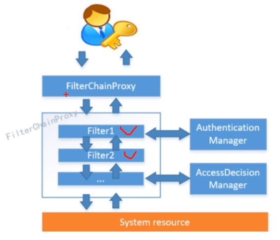
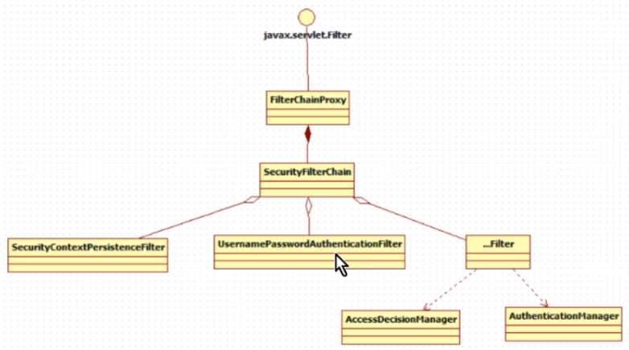
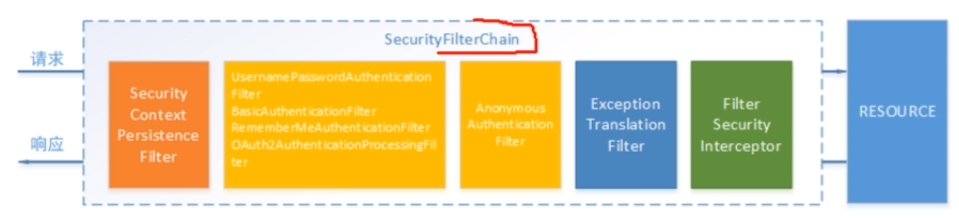
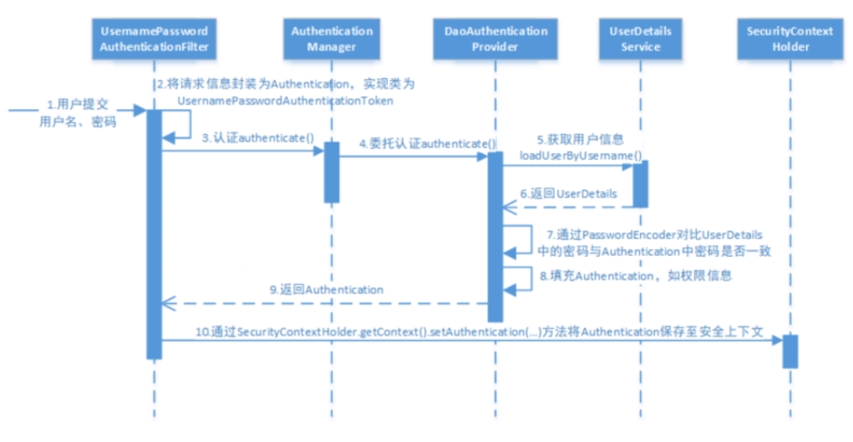
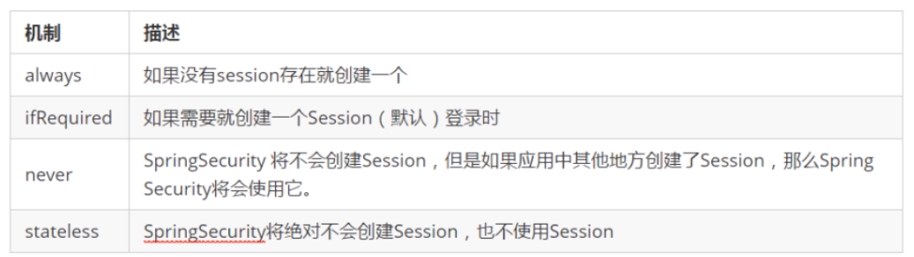

# Spring Security OAuth2.0认证授权

## 1.基本概念

### 1.1.什么是认证?

认证是为了保护系统的隐私数据与资源，用户的身份合法可访问该系统的资源。

认证： 用户认证就是判断一个用户的身份是否合法的过程，用户去访问系统资源时系统要求验证用户的身份信息，身份合法方可继续访问，不合法则拒绝访问。常见的用户身份认证方式有：用户名密码登录，二维码登录，手机短信登录，指纹认证等方式。

### 1.2 什么是会话？

用户认证通过后，为了避免用户的每次操作都进行认证可将用户的信息保存在会话中。会话就是系统为了保持当前用户的登录状态所提供的机制，常见的有基于session方式，基于token方式等。

基于session的认证方式如下图:

它的交互流程是，用户认证成功后，在服务端生成用户相关的数据保存在session(当前会话)中，发给客户端的session_id存放到cookie中，这样用户客户端请求时带上session_id就可以验证服务器端是否存在session数据，以此完成用户的合法校验，当用户退出系统或session过期销毁时，客户端的session_id也就无效了。


基于token方式如下图：

它的交互流程是，用户认证成功后，服务端生成一个token发给客户端，客户端可以放到cookie或localStorage等存储中，每次请求时带上token,服务端收到token通过验证后即可确认用户身份。


基于session的认证方式由Servlet规范定制，服务端要存储session信息需要占用内存资源，客户端需要支持cookie；基于token的方式则一般不需要服务端存储token,并且不限制客户端的存储方式。如今移动互联网时代更多类型的客户端需要接入系统，系统多是采用前后端分离的架构进行实现，所以基于token的方式更适合。

### 1.3 什么是授权？

认证是为了保证用户身份的合法性，授权则是为了更细粒度的对隐私数据进行划分，授权是在认证通过后发生的，控制不同的用户能够访问不同的资源。

**授权**：授权是用户认证通过根据用户的权限来控制用户访问资源的过程，拥有资源的访问权限则正常访问，没有权限则拒绝访问。

### 1.4 授权的数据模型

授权可简单理解Who对What(Which)进行How操作，包括如下：


### 1.5 RBAC

如何实现授权？业界通常基于RBAC实现授权。

#### 1.5.1 基于角色的访问控制

RBAC基于角色的访问控制(Role-Based Access Control)是按角色进行授权，比如：主体的角色为总经理，可以查询企业运营报表，查询员工工资信息等，访问控制流程如下：


#### 1.5.2 基于资源的访问控制

RBAC基于资源的访问控制(Resource-Based Access Controle)是按资源(或权限)进行授权,比如:用户必须具有查询工资权限才可以查询员工工资信息等.


**坑**

# [@Controller和@RestController的区别？](https://www.cnblogs.com/shuaifing/p/8119664.html)

知识点：@RestController注解相当于@ResponseBody ＋ @Controller合在一起的作用。

 

1) 如果只是使用@RestController注解Controller，则Controller中的方法无法返回jsp页面，或者html，配置的视图解析器 InternalResourceViewResolver不起作用，返回的内容就是Return 里的内容。

 

2) 如果需要返回到指定页面，则需要用 @Controller配合视图解析器InternalResourceViewResolver才行。
  如果需要返回JSON，XML或自定义mediaType内容到页面，则需要在对应的方法上加上@ResponseBody注解。

## 2. 基于Session的认证方式

### 2.1 认证流程

## 3. Spring Security集成SpringBoot


### 3.2 工作原理

#### 3.2.1 结构总览

Spring Security所解决的问题就是安全访问控制，而安全访问控制功能其实就是对所有进入系统的请求进行拦截，校验每个请求是否能够访问它所期望的资源。根据前边知识的学习，可以通过Filter或AOP等技术来实现，Spring Security对Web资源的保护是靠Filter实现的,所以从这个Filter来入手，逐步深入Spring Security原理。

当初始化Spring Security时,会创建一个名为SpringSecurityFilterChain的Servlet过滤器，类型为org.springframework.security.web.FilterChainProxy,它实现了javax.servlet.Filter,因此外部的请求会经过此类，下图是Spring Security过滤器链结构图:



FilterChainProxy是一个代理，真正起作用的是FilterChainProxy中SecurityFilterChain所包含的各个Filter,同时这些Filter作为Bean被Spring管理，它们是Spring Security的核心，各有各的职责，但是他们并不直接处理用户的认证，也不直接处理用户的授权，而是把他们交个了认证管理器(AuthenticationManager)和决策管理器(AccessDecisionManager)进行处理，下图是FilterChainProxy相关类的UML图示:



spring Security功能的实现主要是由一些列过滤器链相互配合完成。



下面介绍过滤器链中主要的几个过滤器及其作用：

**SecurityContextPersistenceFilter**:这个Filter是整个拦截过程的入口和出口(也就是第一个和最后一个拦截器)，会在请求开始时从配置好的SecurityContextRepository中获取SecurityContext,然后把它设置给SecurityContextHolder.在请求完成后将SecurityContextHolder所持有的SecurityContext再保存到配置好的SecurityContextRepository,同时清除securityContextHolder所持有的SecurityContext;

**UsernamePasswordAuthenticationFilter**:用于处理来自表单提交的认证。该表单必须提供对应的用户名和密码，其内部还有登录成功或失败后进行处理的AuthenticationSuccessHandler和AuthenticationFailureHandler,这些都可以根据需求做相应改变；

**FilterSecurityInterceptor:**是用于保护web资源的,使用AccessDecisionManager对当前用户进行授权访问。

ExceptionTranslationFilter:能够捕获来自FilterChain所有的异常，并进行处理。但是它只会处理两类异常：AuthenticationException和AccessDeniedException,其它的异常它会继续抛出。

### 3.2.2 认证流程

#### 3.2.2.1认证流程:



让我们仔细分析认证过程：

1.用户提交用户名，密码被SecurityFilterChain中的UsernamePasswordAuthenticationFilter过滤器获取到，封装为请求Authentication,通常情况下是UsernamePasswordAuthenticationToken这个实现类。

2.然后过滤器将Authentication提交至认证管理器(AuthenticationManager)进行认证

3.认证成功后，AuthenticationManager身份管理器返回一个被填充满了信息的(包括上面提取到的权限，身份信息，细节信息，但密码通常会被移除)Authentication实例。

4.SecurityContextHolder安全上下文容器将第3步填充了信息的Authentication,通过SecurityContextHolder.getContext().setAuthenticaiton()方法，设置到其中。

#### 3.2.2.2  AuthenticationProvider

通过前面的Spring Security认证流程我们得知，认证管理器(AuthenticationManager)委托AuthenticationProvider完成认证工作。

AuthenticationProvider是一个接口，定义如下:

```java
public interface AuthenticationProvider {
    Authentication authenticate(Authentication var1) throws AuthenticationException;

    boolean supports(Class<?> var1);
}
```

authenticate()方法定义了认证的实现过程，它的参数是一个Authentication,里面包含了登录用户的定义的用户，密码等。而返回值也是一个Authentication,这个Authentication则是在认证成功后，将用户的权限及其他信息重新组装后生成。

Spring Security中维护着一个List<AuthenticationProvider>列表，存放多种认证方式，不同的认证方式使用不同的AuthenticationProvider.如使用用户密码登录时，使用provider1,短信登录时使用provider2等等

每个AuthenticationProvider需要实现supports()方法来表名自己支持的认证方式，如我们使用表单方式认证时，在提交请求时Spring Security会生成UsernamePasswordAuthenticationToken,它是一个Authentication,里面封装着用户提交的用户名，密码信息。而对应的，是哪个AuthenticationProvider来处理它?

我们在DaoAuthenticationProvider的基类AbstractUserDetailsAuthenticationProvider发现以下代码：

```java
    public boolean supports(Class<?> authentication) {
        return UsernamePasswordAuthenticationToken.class.isAssignableFrom(authentication);
    }
```

也就是说当web表单提交用户密码时，Spring Security由DaoAuthenticationProvider处理。

最后，我们来看一下Authentication的机构，它是一个借口，我们之前提到的UsernamePasswordAuthenticationToken就是它的实现之一:

```java
public interface Authentication extends Principal, Serializable {
    Collection<? extends GrantedAuthority> getAuthorities();

    Object getCredentials();

    Object getDetails();

    Object getPrincipal();

    boolean isAuthenticated();

    void setAuthenticated(boolean var1) throws IllegalArgumentException;
}

```

#### 3.2.2.3 UserDetailsService

1) 认识UserDetailsService

现在咱们知道DaoAuthenticationProvider处理了web表单的认证逻辑，认证成功后既得到一个Authentication(UsernamePasswordAuthentication Token实现)，里面包含了身份信息(Principal)。这个身份信息就是一个Object,大多数情况下它可以被强转为UserDetails对象。

DaoAuthenticationProvider中包含了一个UserDetailService实例，它负责根据用户名提取用户信息UserDetails(包含密码),而后DaoAuthenticationProvider会去比对UserDetailsService提取的用户密码与用户提交的密码是否匹配作为认证成功的关键依据,因此可以通过将自定义的UserDetailsService公开为spring bean来自定义身份验证

```java
public interface UserDetailsService {
    UserDetails loadUserByUsername(String var1) throws UsernameNotFoundException;
}
```

很多人把DaoAuthenticationProvider和UserDetailService的职责混淆，其实UserDetailsService只负责从特定的地方(通常是数据库)加载用户信息，仅此而已。而DaoAuthenticationProvider的职责更大，它完成完整的认证流程，同时会把UserDetails填充至Authentication。

UserDetails用户信息的真面目:

```java
public interface UserDetails extends Serializable {
    Collection<? extends GrantedAuthority> getAuthorities();

    String getPassword();

    String getUsername();

    boolean isAccountNonExpired();

    boolean isAccountNonLocked();

    boolean isCredentialsNonExpired();

    boolean isEnabled();
}

```

### 3. 会话

用户认证通过后，为了避免用户的每次操作都进行认证可将用户的信息保存在会话中。spring security提供会话管理，认证通过后将身份信息放入SecurityContextHolder上下文,SecurityContext与当前线程进行绑定，方便获取用户身份。

#### 3.1 获取用户身份

在controller里增加获取用户身份的方法,如下:

```java
private String getUserName() {
    String username = null;
    Authentication authentication =  SecurityContextHolder.getContext().getAuthentication();
    // 用户身份
    Object principal = authentication.getPrincipal();
    if (principal == null)
    {
        username = "匿名";
    }else if (principal instanceof UserDetails)
    {
        UserDetails userDetails = (UserDetails) principal;
        username = userDetails.getUsername();
    }else
    {
        username = principal.toString();
    }
    return username;
}
```

#### 3 .2会话控制

我们可以通过以下选项准确控制会话何时创建以及Spring Security如何与之交互:

配置方式:

```java
@Override
protected void configure(HttpSecurity http) throws Excption{
    http.sessionManagement()
        .sessionCreationPolicy(SessionCreationPolicy.IF_REQUIRED);  // 配置会话管理方式
}
```

默认情况下,Spring Security会为每个登录成功的用户新建一个Session,就是ifRequired.

若选用never,则指示Spring Security对登录成功的用户不创建session了，但若你的应用程序在某地方新建了session,那么Spring Security会用它的。

若使用stateless,则说明Spring Security对登录成功的用户不会创建Session了，你的应用程序也不会允许新建session.并且它会暗示不使用cookie,所以每个请求都需要重新进行身份验证。这种无状态架构适用于REST API及其无状态认证机制。

**会话超时**

可以在sevlet容器中设置Session的超时时间，如下设置Session有效期为3600s

spring boot 配置文件

```yaml
server.servlet.session.timeout=3600s
```

session超时之后，可以通过Spring Security设置跳转的路径

```java
http.sessionManagement()
    .expiredUrl("/login-view?error=EXPIRED_SESSION")
    .invalidSessionUrl("/login-view?error=INVALID_SESSION")
```

expired指session过期,invalidSession指传入的sessionId无效。

